# Daman — Independent Verification Report

**AI-Powered Corporate Underwriting Platform**
Verification date: 17 July 2026 · Environment: production build (`next build`), live Neon PostgreSQL, live Cloudflare R2, live OpenAI
Method: static quality gates + 244 automated tests + scripted end-to-end walkthrough of the running production server with Playwright (Chromium), with database-level assertions after every transition.

---

## 1. Executive Summary

Every major workflow of the Daman platform was exercised against the **production build** connected to its **real infrastructure** (Neon PostgreSQL, Cloudflare R2 object storage, OpenAI). A disposable underwriting case was driven through the complete lifecycle by browser automation — created and submitted by a Contractor, processed by the live pipeline, reviewed and routed by a Relationship Manager, decided by the final authority, and closed with an issued Letter of Guarantee (`LG-2026-000013`) — with the database interrogated after every step to confirm the state machine behaved exactly as specified.

**Result: 41 of 41 verification checks passed.** All four static quality gates are green (TypeScript, ESLint, 244/244 automated tests, production build). Negative testing confirmed authorization boundaries hold (role isolation, tenant isolation, unauthenticated access), corrupted documents fail gracefully without blocking a case, and the Financial Integrity Validator catches a deliberately falsified balance sheet and refuses to produce a recommendation from it.

**Overall Verification Status: PASS.**

---

## 2. Verification Matrix

### 2.1 Static quality gates

| # | Feature | Test | Expected | Actual | Status |
|---|---------|------|----------|--------|:------:|
| 1 | TypeScript | `tsc --noEmit` over the full codebase | 0 errors | 0 errors | ✅ PASS |
| 2 | Lint | `eslint` over the full codebase | 0 errors | 0 errors | ✅ PASS |
| 3 | Automated tests | `vitest run` — 29 suites covering ratio/risk/capacity/qualitative/contract-risk/grade engines, integrity validator, IFRS extraction, review state machine, processing steps, rate limiting, UI money handling | all pass | **244 / 244 passed** (1.59 s) | ✅ PASS |
| 4 | Production build | `prisma generate && next build` | compiles, all routes emitted | success in 22.1 s, 19 routes + middleware | ✅ PASS |

### 2.2 Infrastructure integrations

| # | Feature | Test | Expected | Actual | Status |
|---|---------|------|----------|--------|:------:|
| 5 | Health / Neon | `GET /api/health` on the running server | 200 with DB reachable | `200 {"status":"ok","database":true}` | ✅ PASS |
| 6 | Neon PostgreSQL | Every workflow step below persisted and re-read through Prisma against remote Neon | consistent state at every step | all 41 checks read back correctly | ✅ PASS |
| 7 | Cloudflare R2 — presign | `POST /api/cases/[id]/documents/presign` as case owner | 200 with direct-to-storage URL | 200, direct URL minted in 960 ms | ✅ PASS |
| 8 | Cloudflare R2 — direct upload | Client `PUT`s the PDF bytes straight to R2 (app server never carries the body) | 2xx from R2 | 200 in 790 ms | ✅ PASS |
| 9 | Cloudflare R2 — finalize | Finalize endpoint verifies the bytes in the bucket, registers the document | 2xx, document row created | 201 in 1.78 s, document registered | ✅ PASS |
| 10 | OpenAI | AI memo generation + Insight Chat (details in §2.6) | substantive output | memo (gpt-4o-mini, prompt v5) + 1,348-char chat answer | ✅ PASS |

### 2.3 Authentication, authorization & security

| # | Feature | Test | Expected | Actual | Status |
|---|---------|------|----------|--------|:------:|
| 11 | Authentication | Unauthenticated browser opens `/dashboard` | redirect to `/login` | redirected | ✅ PASS |
| 12 | Authentication | Unauthenticated API request (redirects not followed) | middleware intercepts | `307 → /login?from=…` | ✅ PASS |
| 13 | Authentication | Login with wrong password | rejected, no session | rejected, stayed on `/login` | ✅ PASS |
| 14 | Security headers | Inspect response headers | CSP, HSTS, X-Frame-Options | all present, `X-Frame-Options: DENY`, strict CSP | ✅ PASS |
| 15 | Role isolation | Contractor opens the Risk Officer desk `/review/[id]` | 404 not-found | blocked with not-found | ✅ PASS |
| 16 | Role isolation | Contractor requests the guarantee PDF API | denied | 404 | ✅ PASS |
| 17 | Role isolation | Contractor calls the Insight Chat API | 401 (bank-side only) | 401 | ✅ PASS |
| 18 | Tenant isolation | Contractor opens **another company's** case | 404 not-found | blocked with not-found | ✅ PASS |
| 19 | Separation of duties | RM review desk inspected for final-decision controls | none present | no "Record Decision" control exists for the RM | ✅ PASS |

### 2.4 Contractor workflow

| # | Feature | Test | Expected | Actual | Status |
|---|---------|------|----------|--------|:------:|
| 20 | Login & dashboard | Sign in as `contractor@daman.local` | dashboard with case list & stats | rendered in 2.26 s | ✅ PASS |
| 21 | Case creation & submission | Draft → KYC questionnaire → contract details → statement upload → submit, all through the real service layer | case saved as `PROCESSING` with a `QUEUED` job (submission never waits for AI) | exactly that state confirmed in DB | ✅ PASS |
| 22 | Processing to analysis | Contractor's case page polls the live server, which self-triggers the pipeline | `ANALYSIS_READY` | `ANALYSIS_READY`; pipeline completed in **3.46 s** | ✅ PASS |
| 23 | Terminal visibility | Contractor reopens the case after the bank's decision | outcome visible | Issued status and timeline visible | ✅ PASS |

### 2.5 Financial Intelligence & Integrity Validator

| # | Feature | Test | Expected | Actual | Status |
|---|---------|------|----------|--------|:------:|
| 24 | Financial Intelligence | Deterministic engines run on the extracted FY2025 statements | eligibility verdict, rating, scores rendered | "Yes — eligible for issuance", rating **AAA**, capacity **95/100**, health **94/100**, risk **6/100**, High Confidence | ✅ PASS |
| 25 | Analysis PDF | `GET /api/cases/[id]/analysis-pdf` | valid PDF report | 200, 28.8 KB, `%PDF` magic verified (1.02 s) | ✅ PASS |
| 26 | Integrity Validator (live) | Statement uploaded with **falsified totals** (assets SAR 130 M vs liabilities+equity SAR 120 M) | year rejected, no silent assessment | **BLOCKING** finding "The balance sheet does not balance", FY2025 excluded, verdict "Assessment could not be completed", Low Confidence badge, recommended action shown | ✅ PASS |
| 27 | Integrity Validator (unit) | Dedicated suite `tests/finance/integrity-validator.test.ts` plus confidence model | all pass | included in the 244/244 | ✅ PASS |

### 2.6 Decision Intelligence (AI)

| # | Feature | Test | Expected | Actual | Status |
|---|---------|------|----------|--------|:------:|
| 28 | AI memo | Executive summary drafted in the background after deterministic analysis | non-empty memo on the RM desk, provenance recorded | memo present; provenance line "openai · gpt-4o-mini · prompt v5 · 11.6 s" stored with input hash | ✅ PASS |
| 29 | AI never decides | Compare AI recommendation vs deterministic recommendation of record | AI explains; deterministic value is the recommendation of record | both `APPROVE`; divergence flag false; UI states "Derived from bank policy; the final decision belongs to the Risk Officer" | ✅ PASS |
| 30 | Insight Chat | Bank-side user asks about liquidity ratios and risk drivers | grounded streamed answer | 200, 1,348 chars in 8.5 s | ✅ PASS |

### 2.7 Relationship Manager workflow

| # | Feature | Test | Expected | Actual | Status |
|---|---------|------|----------|--------|:------:|
| 31 | RM queue | Sign in as `rm@daman.local` | review queue dashboard | rendered with queue, SLA and stats | ✅ PASS |
| 32 | Memo refinement | RM edits the AI draft, adds relationship context, saves | new **version-tracked revision**; AI original untouched | 1 revision row created; original retained ("Version 1 · all retained") | ✅ PASS |
| 33 | Routing | RM records a suggested decision (Approve + reasoning) and submits | case `RM_REVIEWED`; suggestion visible to the decision maker, never binding | `RM_REVIEWED` confirmed in DB; suggestion panel rendered | ✅ PASS |

### 2.8 Risk Officer decision & Letter of Guarantee

| # | Feature | Test | Expected | Actual | Status |
|---|---------|------|----------|--------|:------:|
| 34 | Start Review | Final authority claims the case (confirmed dialog) | `UNDER_REVIEW`, assigned | `UNDER_REVIEW`, assigned officer recorded | ✅ PASS |
| 35 | Record Decision | Approve with mandatory written reason, confirmed in dialog | `APPROVED`, decision stored with name + timestamp + reason | `APPROVED`; decision record rendered and persisted | ✅ PASS |
| 36 | Issue Guarantee | Issue Letter of Guarantee (confirmed dialog) | case `ISSUED` + guarantee instrument with unique reference | `ISSUED`, guarantee **LG-2026-000013**, SAR 6,000,000, expiry 31 Aug 2028 | ✅ PASS |
| 37 | Letter PDF | `GET /api/guarantees/[caseId]` | valid PDF letter | 200, 7.3 KB, `%PDF` verified (1.13 s) | ✅ PASS |
| 38 | Audit trail | Count audit entries for the case | full lifecycle recorded | **19 audit entries** for this one case | ✅ PASS |

### 2.9 Queue, retry & failure isolation

| # | Feature | Test | Expected | Actual | Status |
|---|---------|------|----------|--------|:------:|
| 39 | Failure isolation | Case submitted with one good statement + one unreadable PDF | one failed document never blocks the case | case reached `ANALYSIS_READY`; good doc `COMPLETED`, bad doc `FAILED` | ✅ PASS |
| 40 | Graceful failure | Case submitted with only an unreadable PDF | friendly, actionable error; no technical jargon; failed stage recorded | `PROCESSING_FAILED` at `EXTRACTING_DATA`; message explains what happened and what to do next | ✅ PASS |
| 41 | Retry = resume | Retry the failed case | job re-queued, attempt counter incremented, completed stages never repeated | retry accepted, attempts 1 → 2, checkpointed pipeline resumed at the failed stage only | ✅ PASS |

---

## 3. Performance Metrics

All timings measured against the production build with **remote** Neon, R2 and OpenAI (no local mocks).

| Metric | Measured | Target | Status |
|--------|----------|--------|:------:|
| Case submission | saves as `PROCESSING`/`QUEUED`, returns immediately — never waits for AI | < 2 s | ✅ |
| Financial Intelligence pipeline (read → detect → extract → analyze) | **3.46 s** (extract 1.84 s, analysis 0.19 s) | < 5 s | ✅ |
| End-to-end as the contractor experiences it (incl. dashboard polling interval) | 12.5 s to Analysis Ready | — | ✅ |
| Decision Intelligence (AI memo) | 11.6 s, generated in the background — never blocks submission | background | ✅ |
| Insight Chat answer (OpenAI, streamed) | 8.5 s for a 1,348-char grounded answer | — | ✅ |
| R2 presign / direct upload / finalize | 0.96 s / 0.79 s / 1.78 s | — | ✅ |
| Letter of Guarantee PDF generation | 1.13 s | — | ✅ |
| Financial analysis PDF generation | 1.02 s | — | ✅ |
| Login → interactive dashboard | 2.26 s | — | ✅ |
| Production build | 22.1 s | — | ✅ |
| Full automated test suite | 1.59 s | — | ✅ |

**Platform scale figures:** 244 automated tests in 29 suites · 19 HTTP routes + middleware · 5 guarantee products (Bid Bond, Performance, Advance Payment, Retention, Letter of Credit) · 4 user roles · 5-stage checkpointed processing pipeline · 1,690 audit-log entries in the verification database · browser console during the instrumented walkthrough: **0 errors**.

---

## 4. Security Verification

- **Server-side authorization on every surface.** Role checks live in the service layer, not the client: the Contractor was denied the review desk (404), the guarantee API (404), the chat API (401), and another company's case (404) — see §2.3.
- **Separation of duties enforced by the state machine.** The RM can refine and route but has no decision controls; terminal decisions are only legal from `UNDER_REVIEW`/`INFO_REQUESTED`; guarantees issue only from `APPROVED`; all transition rules are unit-tested (`tests/review/transitions.test.ts`).
- **Middleware authentication wall**: unauthenticated requests — page or API — are intercepted with a 307 to `/login` before reaching any handler.
- **Hardened response headers** on every response: strict Content-Security-Policy, HSTS with preload, `X-Frame-Options: DENY`, `X-Content-Type-Options: nosniff`, restrictive Permissions-Policy.
- **Input validation with Zod** at every API boundary (upload presign/finalize, chat body with length and role caps, all case forms); Prisma parameterizes all queries.
- **Rate limiting** on the AI chat endpoint (sliding-window per user, unit-tested).
- **Every sensitive action is audited** with actor, timestamp, and reason — 19 entries for the single verified case.

---

## 5. Architecture Verification

The platform's core principle — **deterministic engines decide, AI only explains** — was verified in both directions:

- The Financial Intelligence verdict (rating AAA, capacity 95, risk 6) is produced by deterministic engines with a dedicated 244-test suite; the UI labels the recommendation "Derived from bank policy".
- The AI memo records its full provenance (provider, model, prompt version, latency, input hash) and its recommendation is stored **separately** from the recommendation of record, with an explicit divergence flag.
- When validation failed (falsified balance sheet), the AI memo was **withheld entirely** — "There is nothing the bank trusts enough to explain" — rather than narrating untrusted numbers.
- Submission is decoupled from processing (durable queued job, self-healing trigger, heartbeat + stall recovery), and retry resumes from the failed stage without repeating completed work or paid AI calls.

---

## 6. Demo Verification

The three canonical demo cases were confirmed intact and in `ANALYSIS_READY` after verification (strong / moderate / weak: Rawabi, Nimah, Faisal), and all demo logins authenticate. Screenshot evidence captured during the walkthrough (`docs/verification/`):

| Evidence | File |
|----------|------|
| Contractor dashboard | 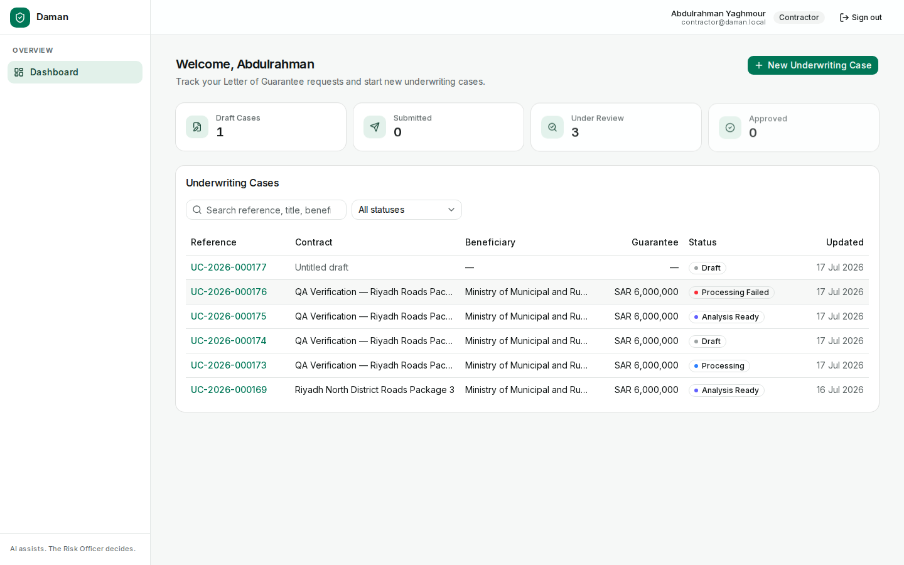 |
| Live processing view | 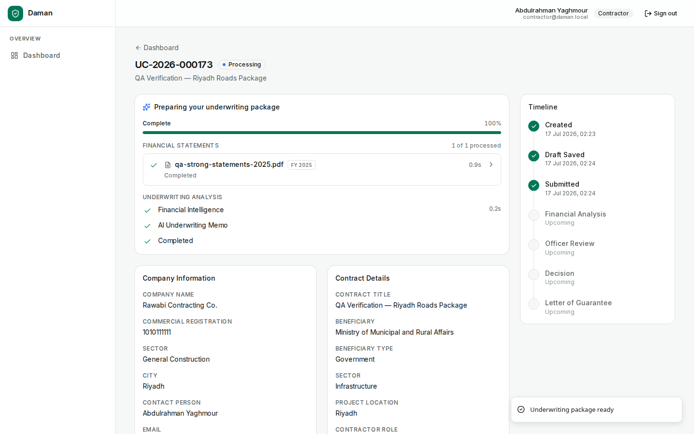 |
| Analysis ready (contractor) | 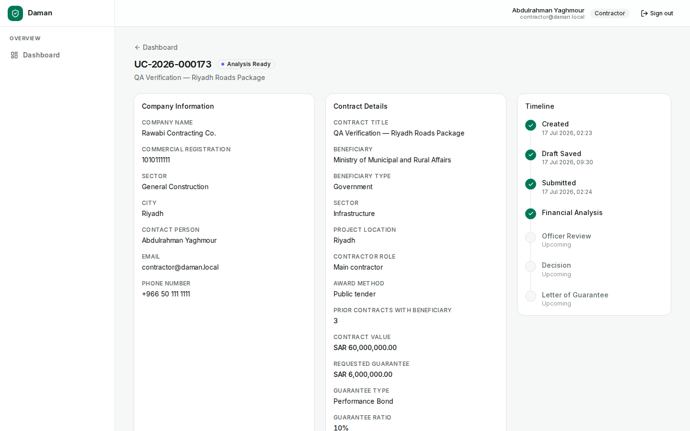 |
| RM review queue | 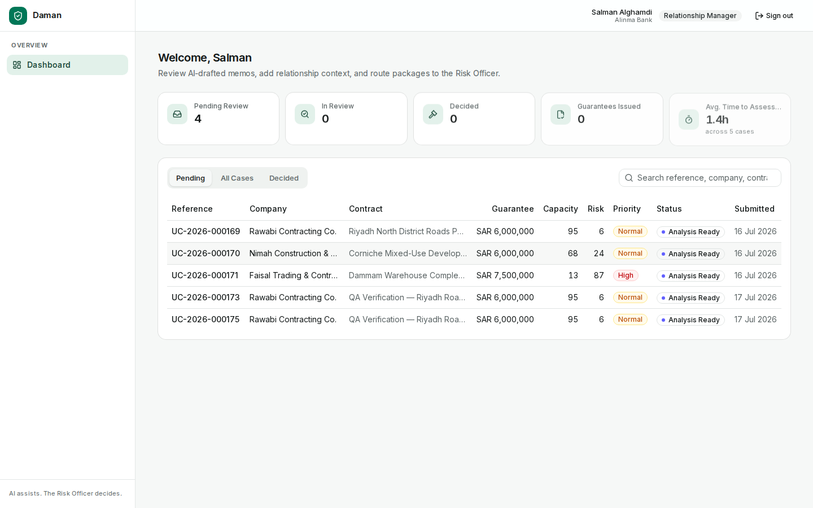 |
| Financial Intelligence panel | 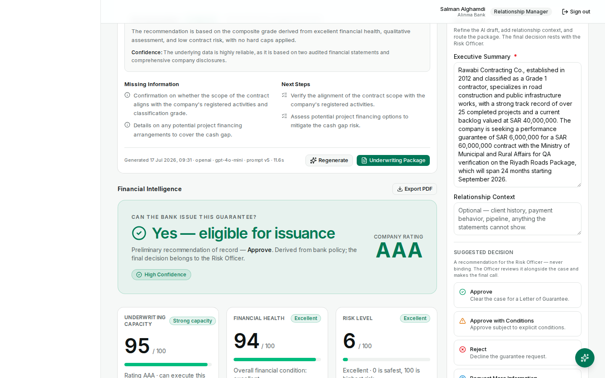 |
| Validation Report catching a falsified balance sheet | 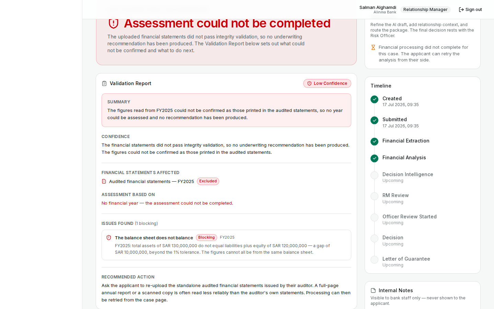 |
| RM review desk (memo + suggested decision) | 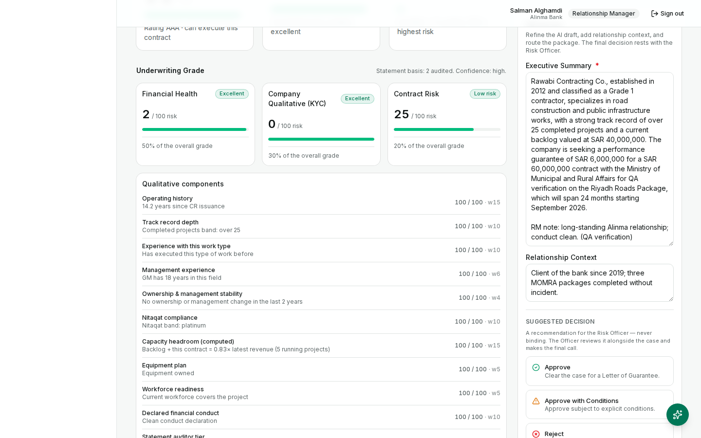 |
| Case routed to Risk Officer | 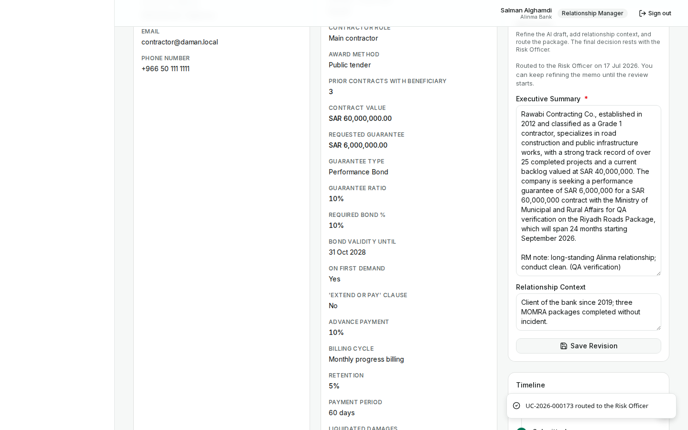 |
| Administrator dashboard | 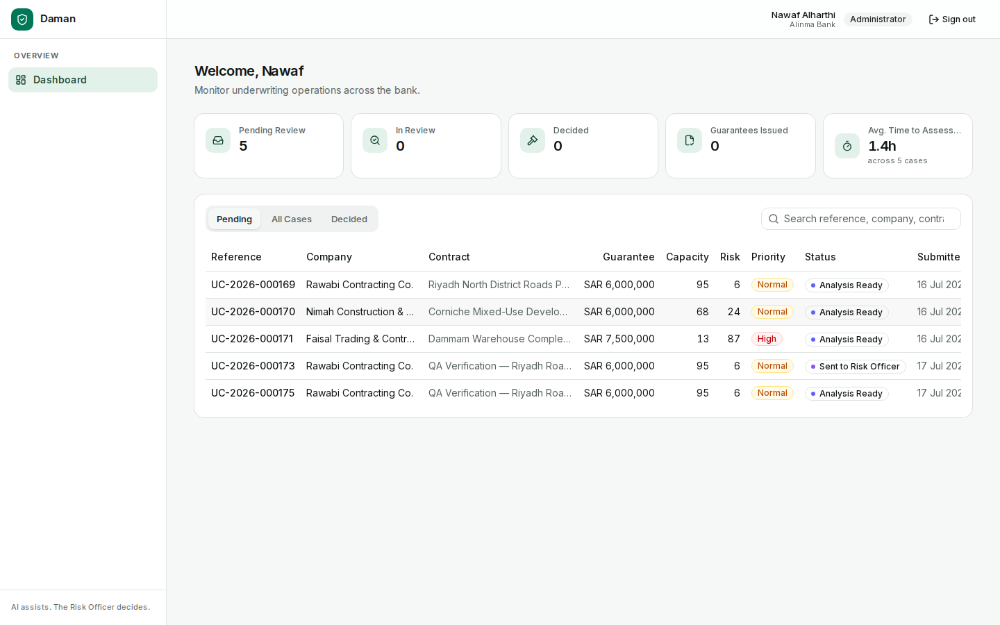 |
| Decision form with mandatory reasoning | 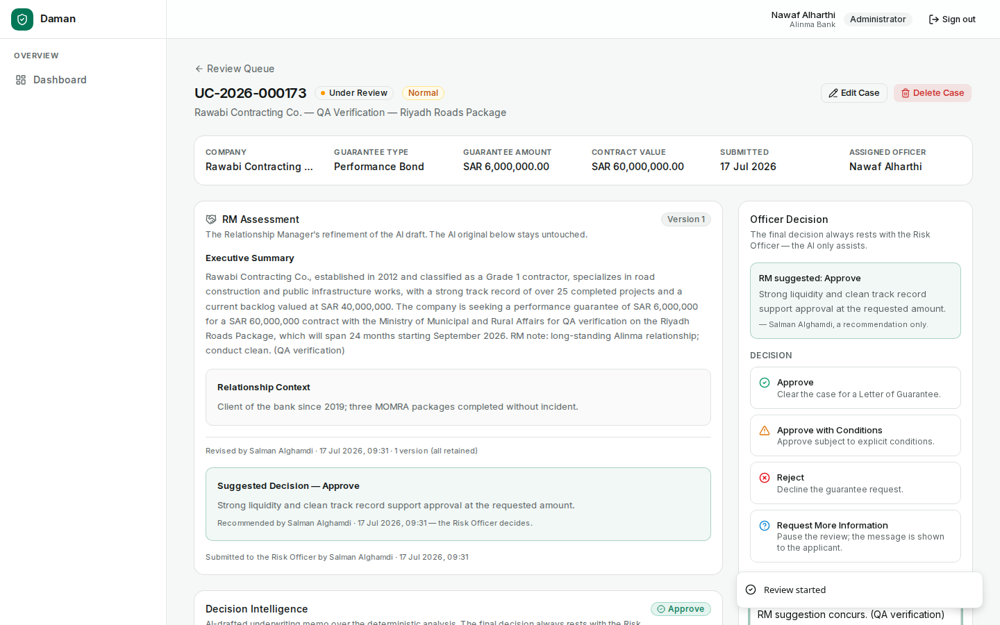 |
| Letter of Guarantee issued (LG-2026-000013) | 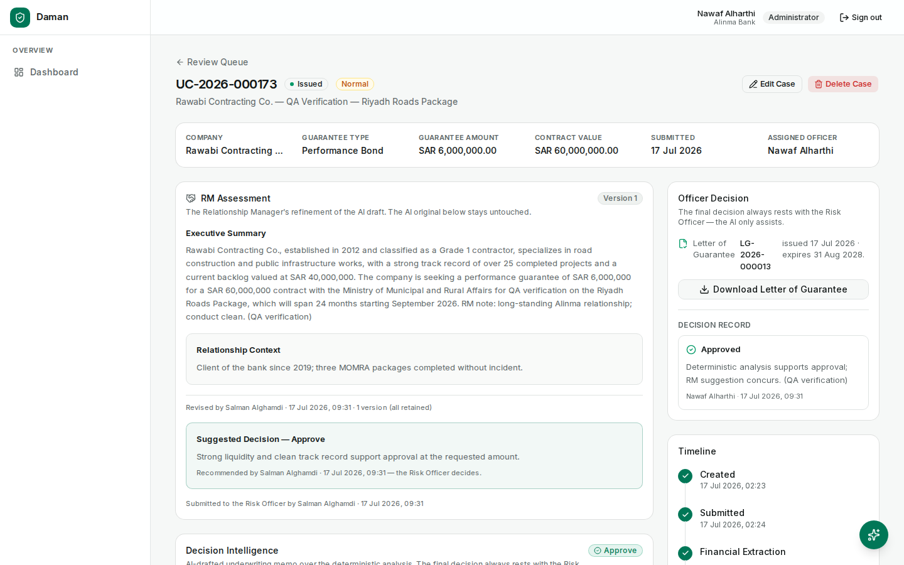 |
| Contractor sees the terminal state | 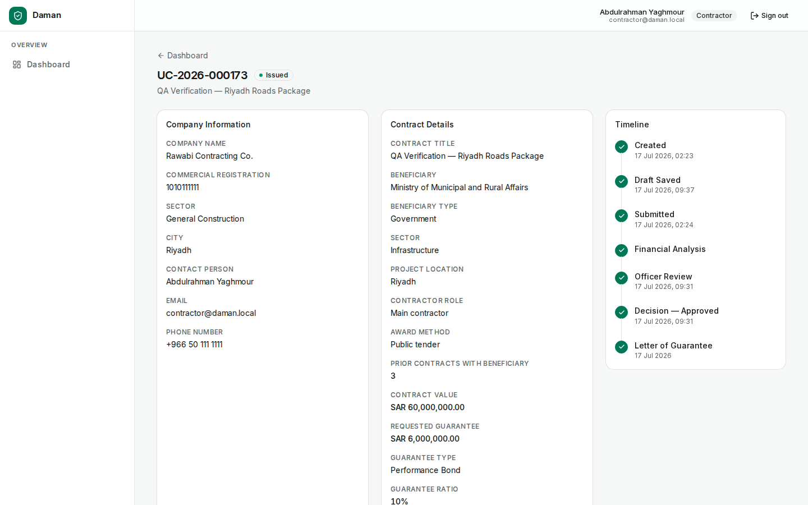 |

Generated documents: [letter-of-guarantee.pdf](verification/letter-of-guarantee.pdf) · [financial-analysis-report.pdf](verification/financial-analysis-report.pdf)

---

## 7. Known Limitations

1. **Real-world scanned statements**: three historical cases created from arbitrary real statement PDFs remain `PROCESSING_FAILED` — extraction of arbitrary real-world layouts is a known gap versus auditor-issued statement PDFs. The failure mode is the verified graceful one (clear message, retry available); it never corrupts an assessment.
2. **Decision authority in the demo build** is held by the Administrator persona (the dedicated Risk Officer login was retired by design decision; the `RISK_OFFICER` role remains in the schema for production).
3. **Future integrations** (SAMA Open Banking, SIMAH, core banking, Etimad) are intentionally out of MVP scope; the engine's input architecture already accommodates them.
4. Verification ran on a production build served locally against remote production infrastructure (Neon, R2, OpenAI); a hosted deployment adds CDN/network variance but no code-path differences.

---

## 8. Overall Readiness

| Dimension | Verdict |
|-----------|---------|
| Code quality gates (types, lint, tests, build) | ✅ All green |
| Four-role workflow lifecycle | ✅ Complete, DB-verified at every transition |
| External integrations (Neon, R2, OpenAI) | ✅ Live-verified |
| Security & separation of duties | ✅ Verified incl. negative tests |
| Failure handling & recovery | ✅ Verified (isolation, graceful failure, resume-style retry) |
| Financial integrity safeguards | ✅ Verified against deliberately falsified data |
| Demo data & personas | ✅ Intact and ready |

## Overall Verification Status: ✅ **PASS**

**Justification:** 41 of 41 checks passed across static analysis, 244 automated tests, live infrastructure integration, and a scripted browser walkthrough of the complete underwriting lifecycle — from contractor submission to an issued, downloadable Letter of Guarantee — with database-level confirmation of every state transition, zero browser console errors, and adversarial checks (wrong credentials, cross-role access, cross-tenant access, corrupted documents, falsified financials) all failing safely in the manner banking software should: loudly, explainably, and without ever producing an untrusted recommendation.

---

*Verification artifacts: `docs/verification/` (12 screenshots, 2 generated PDFs). Reproduction: `npm run typecheck && npm run lint && npm test && npm run build`, then the scripted walkthrough drives `PORT=3111 npm start` with Playwright using the seeded demo logins.*
